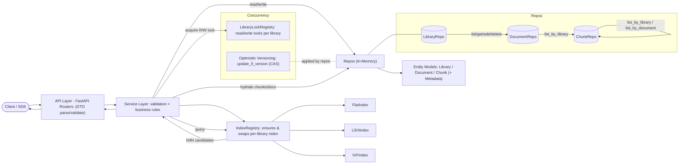

## 1. VectorDB API — Document Indexing & Semantic Search

A production-ready REST API layer built on top of a vector database for document indexing and semantic search. This API allows users to create libraries of documents, chunk them into searchable pieces, and perform powerful semantic search queries using vector embeddings.

## 2. Features
- **Library & Chunk CRUD**: create, read, update, delete libraries and chunks (bulk upserts supported).
- **Per-Library Indexing**: pluggable index per library (Flat / LSH / IVF), hot-swappable via config.
- **k-Nearest Neighbor Search with Filtering**: cosine-similarity (configurable) search with optional document/chunk filters.
- **Concurrency Safety**: per-library read/write locks + optimistic concurrency (`version` + CAS).
- **Typed Schemas**: Pydantic models for domain entities and (optional) typed metadata.
- **Clean Layering**: API → Services → Concurrency → Repos (DDD-inspired separation).

## 3. Architecture

### 3.1 Functional Requirements
1. CRUD operations on **libraries**.  
2. CRUD operations on **chunks** within a library (documents are optional convenience endpoints).  
3. **Index** the contents of a library using a selected index strategy.  
4. Perform **k-Nearest Neighbor (k-NN)** vector search over a library for a given embedding query.

### 3.2 Assumptions
- Clients supply embeddings; the API does **not** generate embeddings.
- In-memory repositories are used.
- Single-process API (one worker) to keep in-memory state coherent.
- CRUD operations on documents in a library might be needed in the future and thus added similar to chunks in a library.

### 3.3 Out-of-Scope
- Multi-process clustering / sharding across nodes.
- Authentication/authorization, quotas, rate limiting.
- Automatic ingestion/embedding pipelines.
- External persistent stores (e.g., Postgres/pgvector) — can be added later by swapping repos.

### 3.4 High-Level Design (DDD-inspired)



**Responsibilities**
- **API Layer**: parse/validate DTOs, map to service calls, convert domain errors → HTTP.
- **Service Layer**: enforce business rules (dim checks, existence), acquire locks, call repos, maintain index, commit via CAS (`update_if_version`), release locks.
- **Concurrency Layer**: per-library read/write locks (sorted dual-lock order for cross-library ops) + optimistic versioning (prevent lost updates).
- **Repo Layer**: store entity models, maintain secondary indexes (`_by_library`, `_by_document`), support bulk deletes; return deep copies.
- **Index Registry/Indexes**: per-library handle; `add/update/remove/search/rebuild`. Index data is volatile; rebuilt from chunks on startup and after config changes.

### 3.5 Indexing & Querying Flow 

Indexing Flow: `demos/indexing_sequence_diagram.png`

Querying Flow: `demos/querying_sequence_diagram.png`

### 3.6 Indexing Strategies

**Flat (Exact)**
- **Adds/Updates/Removes:** O(d) per op (store normalized vector).  
- **Search:** full scan & exact cosine; **O(N·d)**.  
- **Space:** O(N·d).  
- **Why:** simplest, exact results; good for small/medium libraries or baseline correctness.

**LSH (Random Hyperplane, cosine)**
- **Params (exposed):** `num_tables = L`, `hyperplanes_per_table = H` (oversample is an internal constant).  
- **Add/Update/Remove:** rehash across L tables; **O(L·H·d)**.  
- **Search:** hash query (O(L·H·d)) → union candidates **C** → exact re-rank **O(C·d)**.  
- **Space:** vectors O(N·d) + bucket refs O(L·N).  
- **Why:** sublinear candidate set; tunable speed/recall trade-off.

**IVF (Inverted File, cosine)**
- **Params (exposed):** `num_centroids = k`, `nprobe`.  
- **Rebuild/Train:** k-means over normalized vectors, ≈ **O(iter · N · k · d)**.  
- **Add/Update:** assign to nearest centroid **O(k·d)**.  
- **Search:** score centroids **O(k·d)** → scan `nprobe` lists (**C** candidates) → exact re-rank **O(C·d)**.  
- **Space:** vectors O(N·d) + centroids O(k·d) + postings O(N).  
- **Why:** strong locality; robust ANN with good throughput.

### 3.7 Technology Stack
- **FastAPI** (API framework)  
- **Pydantic v2** (validation & domain models)  
- **Python 3.11+**  
- **Uvicorn** (ASGI server)  
- **Docker** (packaging & runtime)

## 4. Project Structure
```
vector-db-api/
├── src/
│   └── vector_db_api/
│       ├── api/                 # API routes and DTOs
│       ├── models/              # Data models and entities
│       ├── services/            # Business logic
│       ├── repos/               # Data access layer
│       ├── indexing/            # Vector indexing strategies
│       ├── concurrency/         # Concurrency utilities
│       └── main.py              # Application entry point
├── tests/                       # Test suite
├── docker-compose.yml           # Docker Compose configuration
├── Dockerfile                   # Docker image definition
├── Makefile                     # Development commands
└── pyproject.toml               # Python packaging and dependencies
```

## 5. Installation

### Option 1: From Source

```bash
# Clone the repository
git clone https://github.com/Kshitij-Bakliwal/vector-db-api.git
cd vector-db-api

# Create virtual environment
python -m venv venv
source venv/bin/activate  # On Windows: venv\Scripts\activate

# Install dependencies
pip install .
```

### Option 2: Using Docker

```bash
# Clone the repository
git clone https://github.com/yourusername/vector-db-api.git
cd vector-db-api

# Build and run with Docker
make setup

# Or for development with hot reloading
make dev-setup
```

### Option 3: Using pip (when published)

```bash
pip install vector-db-api
```

## 🚀 Quick Start

### Local Development

```bash
# Start the API server
uvicorn src.vector_db_api.main:app --reload

# API will be available at http://localhost:8000
# Interactive docs at http://localhost:8000/docs
```

### Using Docker

```bash
# Production mode
make run

# Development mode with hot reloading
make dev

# Using docker-compose
make compose
```

### Basic Usage Example

```python
import requests

# Create a library
response = requests.post("http://localhost:8000/libraries", json={
    "name": "demo-lib",
    "embedding_dim": 3,
    "index_config": { "type": "flat" },
    "metadata": {}
})
library_id = response.json()["id"]

# Add a document with chunks
response = requests.post(f"http://localhost:8000/libraries/{library_id}/documents/with-chunks", json={
      "metadata": {},
      "chunks": [
         { "text": "hello vector world", "position": 0, "embedding": [1.0, 0.0, 0.0],  "metadata": { "tags": ["intro"] } },
         { "text": "semantic search is fun", "position": 1, "embedding": [0.9, 0.1, 0.0],  "metadata": { "tags": ["search"] } },
         { "text": "vector embeddings map meaning", "position": 2, "embedding": [0.8, 0.0, 0.2], "metadata": { "tags": ["embeddings"] } },
         { "text": "apples and oranges comparison", "position": 3, "embedding": [0.0, 1.0, 0.0],  "metadata": { "tags": ["fruits"] } },
         { "text": "cosine similarity measures angle", "position": 4, "embedding": [0.85, 0.15, 0.0], "metadata": { "tags": ["similarity"] } }
      ]
})
# Check the response
response

# Perform a query embedding based search
response = requests.post(f"http://localhost:8000/libraries/{library_id}/search", json={
      "query_embedding": [0.95, 0.05, 0.0],
      "k": 3
})
results = response.json()["results"]

print(*results, sep='\n\n')
```

## 🧪 Testing

```bash
# Install dev dependencies
pip install .[dev]

# Run all tests
python tests/run_tests.py


# Run specific test types
python tests/run_tests.py --unit
python tests/run_tests.py --integration

# Using Docker
make test
```

## 6. Possible Next Improvements
- **Pluggable persistence**: swap in Postgres/pgvector repos; keep services/API unchanged.
- **AuthN/AuthZ & multi-tenancy**: API keys, tenants, quotas.
- **External IDs for documents**: support a stable external_id natural key (e.g., URL/S3 path) for idempotent upserts, deduping, and easy re-ingestion.
- **Optimized index selection**: auto-choose index per library based on size & usage (e.g., Flat <100k vectors; IVF for 100k–10M; LSH for high-throughput cosine; consider dynamic thresholds + telemetry-driven reconfiguration).
- **Index metrics & tuning**: per-library stats (build time, candidate sizes, recall).
- **WAL (write-ahead log)**: near-zero data loss between snapshots; snapshot + WAL replay on startup.
- **Observability**: structured logs, Prometheus metrics, trace IDs.
- **CI/CD**: GitHub Actions workflow to build/test/push Docker images.
- **Rate limiting & DoS hardening**: via Nginx or upstream gateway.
